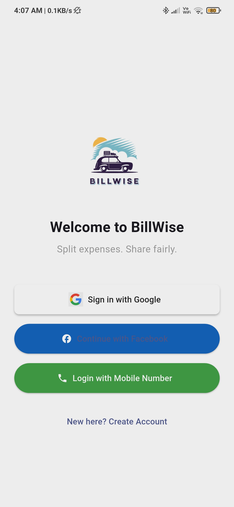
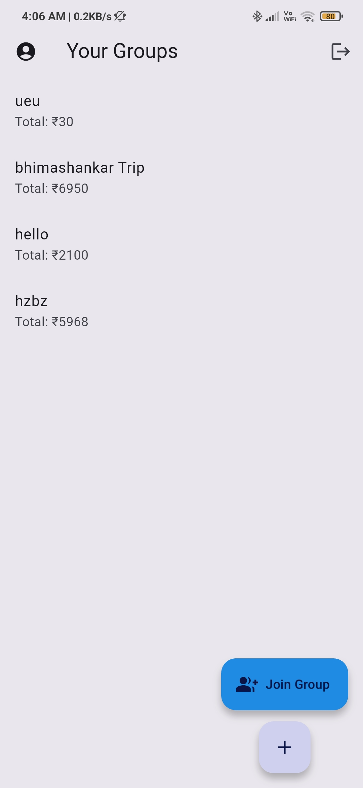
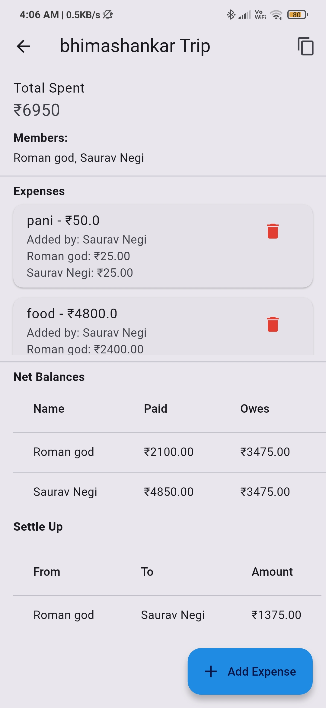
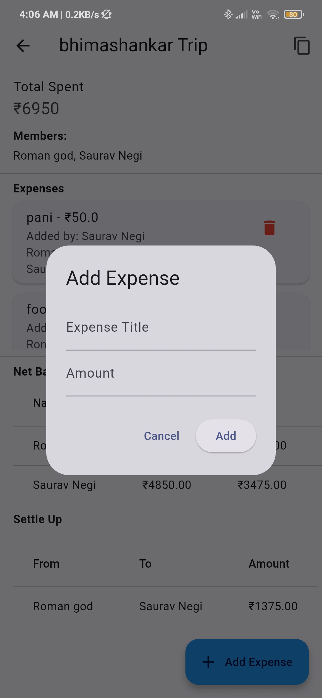
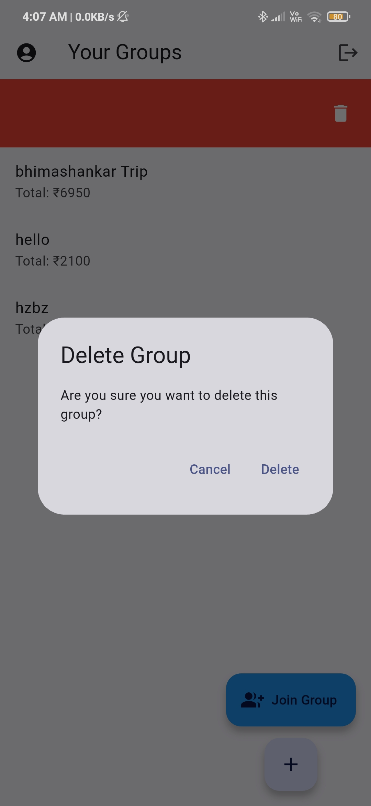
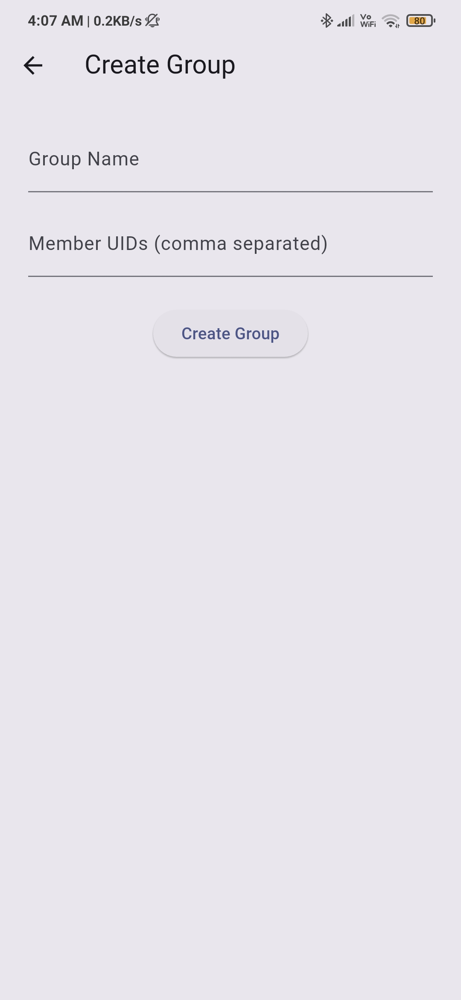

# BillWise – Group Expense Splitter App

BillWise is a Flutter-based mobile app that lets users create and manage group expenses easily. It helps friends split costs and calculate who owes whom — all in real time.

## 🔧 Tech Stack
- Flutter
- Firebase (Authentication & Firestore)
- Dart

## ✨ Features
- Create and join groups
- Add expenses and split bills
- Real-time sync across users
- Automatic settlement calculations
- Firebase user authentication

<h3>📸 Screenshots</h3>

  

    
    
Login Page

  

  

    
    
Home Page

  

  

    
    
Group Detail Page

  

  

    
    
Add Expense Page

  

  

    
    
Profile Page

  

  

    
    
Delete Confirmation

  

  

    
    
Join Group Page

  

  

    
    
Create Group Page

  

## 🚀 How to Run
1. Clone this repo
2. Run `flutter pub get`
3. Add your own Firebase config in `/android/app/google-services.json`
4. Run using `flutter run` on emulator or device

## 📎 License
This project is licensed under the MIT License.
